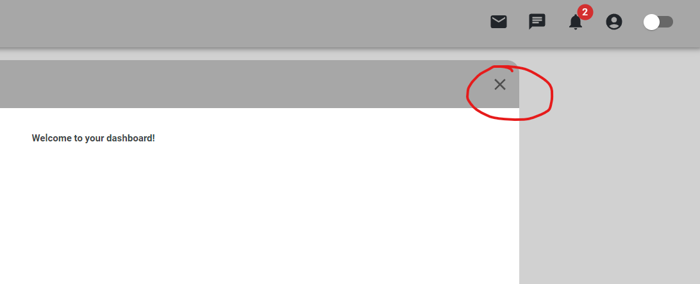
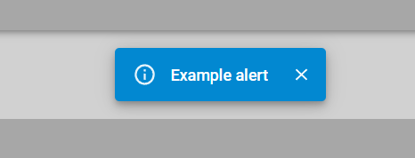
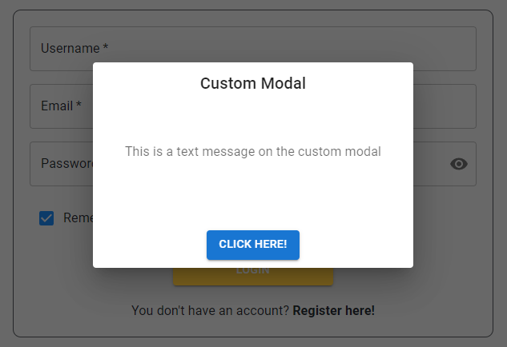
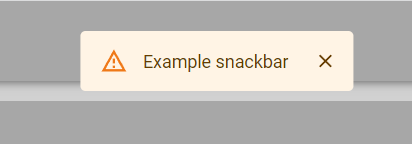
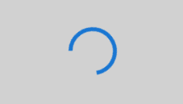
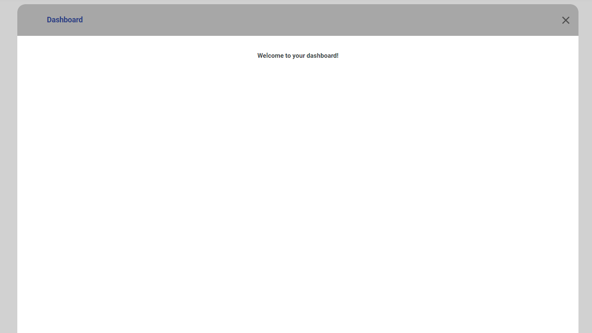
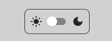

# Reusable components

We have some components you can use so you don't have to reivent the wheel. These are some reusable components we have created that you can use in certain parts of the application depending on what you are creating.

Reusable components code can be found at [src/components](../src/components).

Current reusable components:

- CloseButton
- CustomAlert
- Custom Modal
- CustomSnackbar
- LoadingSpinner
- Panel
- ThemeSwitch

## Descriptions of each component:

### _CloseButton_

A close button that can be added to components in order to close them.

_Screenshot of component:_

 
 

### _CustomAlert_

An alert you can use to display short important messages to the user.

_Screenshot of component:_

 
 

### _CustomModal_

A modal popup you can use to inform users and also have them perform an action.

_Screenshot of component:_

 
 

### _CustomSnackbar_

A snackbar you can use to inform users that the app has or will perform an action.

_Screenshot of component:_

 
 

### _LoadingSpinner_

A loading spinner you can use to create transitions while waiting for content to load.

_Screenshot of component:_

 
 

### _Panel_

The main reusable panel for the different app sections(dashboard, events, friends, settings, etc). Use this component when creating a new section for the app.

_Screenshot of component:_

 
 

### _ThemeSwitch_

A switch component used in order to change the app's theme(light mode or dark mode).

_Screenshot of component:_

 
 
